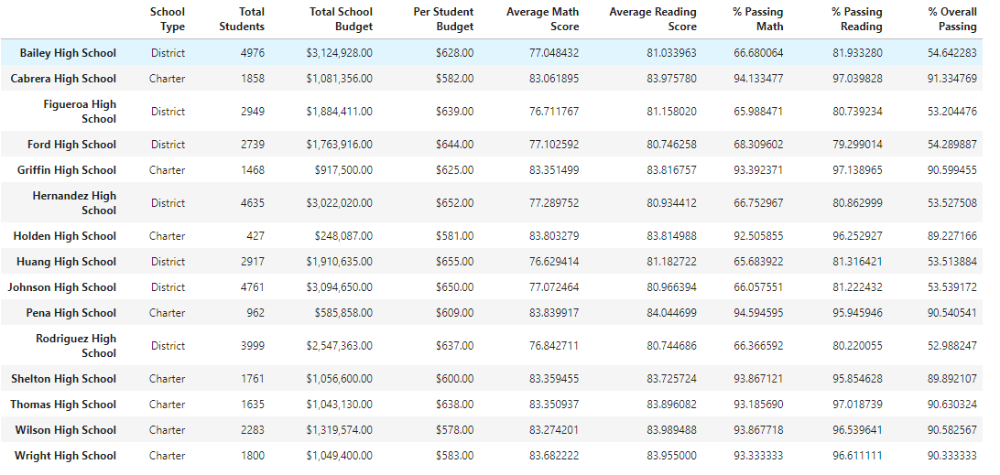

# School District Pandas Analysis

## Overview of Analysis

### Purpose
Our purpose for the analysis was a continuation from the original school district analysis submitted to Maria's team which covered standardized test scores from students and key variables on the schools. The analysis provided insights which Maria's team used to assist in decisions on the district level. After the original was submitted it was determined a portion of the data was corrupted from academic dishonestly, and needed to be replaced with NaN values. After the data was replaced our goal is to recreate the school district analysis with a clean set of data, and then review to determine how the change affected the overall analysis. 

## School District Results

### District Takeaways
- For the District Summary after the 9th grade Thomas High School class was removed the only change was a .1 decrease in the Average Math Score from 79.0 to 78.9.
- For the School Summary after the 9th grade Thomas High School class was removed as shown in the DataFrame below, there were slight changes to the Average Scores and Passing Percentages for Thomas High school. The Average Reading score went slightly up while Average Math and each Passing Percentage experienced a slight dip. No changes were greater than a full point. 
- The changes in performance only being slight for Thomas High School after the 9th grade scores were removed is shown in their performance relative to other schools for Overall Passing Percentage, because they did not move from the second highest position within the district. 
- In addition replacing the 9th grade class affected the following by:
	- Only removing the 9th grade class for Thomas High School from the Math and Reading scores by grade dataframe.
	- Does not have a noticeable affect in the scores by school spending.
	- Does not have a noticeable affect in the scores by school size. 
	- Does not have a noticeable affect in the scores by school type. 

## District School Analysis Summary

### Takeaways from Clean District School Analysis
The main changes after the reading and math scores for the ninth grade at Thomas High School were replaced with NaNs are centered on the overall test scores for the school. After the ninth-grade scores were removed from the calculation for the percentages of passing students for math, reading, and overall there was a slight decrease in each of these results for Thomas High School. There was a positive for the school after the ninth-grade data was removed, and that is the Average Reading score slightly increased from 83.848 to 83.896. 

